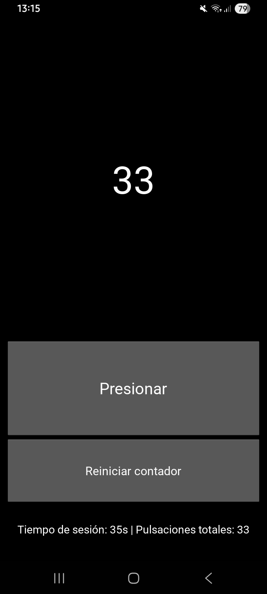

## 📱 Evaluación Nº5 — Aplicación Kivy Contador + Paquetización Android (APK) y Métricas

- Proyecto desarrollado para la asignatura Desarrollo Móvil.
- En este repositorio se presenta una aplicación realizada en Kivy, su paquetización en APK mediante Buildozer y la implementación de métricas básicas de uso.

# 🧠 1. Objetivos de la Evaluación

Este proyecto demuestra:

- ✅ Paquetización completa de una app Kivy en Android usando Buildozer.
- ✅ Implementación de métricas de interacción (logs, eventos, duración de sesión).
- ✅ Uso correcto de repositorio GitHub con estructura ordenada.
- ✅ Documentación clara (README profesional + PDF incluido).
- ✅ Registro y reflexión del uso de Inteligencia Artificial.

# 🚀 2. Aplicación: Descripción General

La aplicación desarrollada es un proyecto simple en Kivy que incluye:

- Una interfaz gráfica funcional de un contador.
- Registro de métricas mediante logs.
- Generación automática de archivos .log.
- Compilación exitosa a formato APK instalable en Android.

# 📦 3. Parte 1 – Paquetización en Android (Buildozer)

✔ Tecnologías utilizadas

- Kivy
- Python 3
- Buildozer
- OpenJDK 17
- Cython 0.29.37
- WSL (Ubuntu 24.04) para compilar el APK

✔ Pasos realizados (resumen)

1. Instalación de dependencias en WSL.
2. Creación y activación de un entorno virtual.
3. Inicialización con buildozer init.
4. Edición del archivo buildozer.spec:
   - package.name
   - package.domain
   - source.dir
5. Compilación final con:
   - buildozer -v android debug
6. Obtención del APK desde /bin/.

# 📊 4. Parte 2 – Implementación de Métricas

Se implementaron métricas básicas, incluyendo:

✔ Registro de eventos

- Presión de botones
- Acciones relevantes del usuario

✔ Tiempo de sesión

- Momento de entrada
- Momento de salida
- Cálculo de duración

✔ Archivos generados

- El proyecto genera automáticamente logs como:

- metrics.log
- metrics.json

- Estos archivos están incluidos en el repositorio según lo solicitado.

# 🔨 5. Instalación y Ejecución

Para instalar la APK en Android se deben de seguir los siguientes pasos:

1. Abrir GitHub desde el celular y descargar la APK desde la pestaña Releases.
2. Habilitar "Instalar apps desconocidas".
3. Instalar normalmente.
4. Ejecutar aplicación.

# 📷 6. Capturas del Proyecto

En esta captura se observa la aplicación desde un celular android.

# 🧾 7. Conclusiones

Este proyecto cumple con los objetivos principales de la evaluación: se desarrolló una aplicación funcional en Kivy, se implementaron métricas básicas de uso y se realizó exitosamente la paquetización a un archivo APK instalable en Android. Además, se organizó el repositorio siguiendo buenas prácticas, incluyendo código, APK, logs y documentación. El resultado es una aplicación simple pero completa, correctamente documentada y totalmente funcional para los fines de la asignatura.
